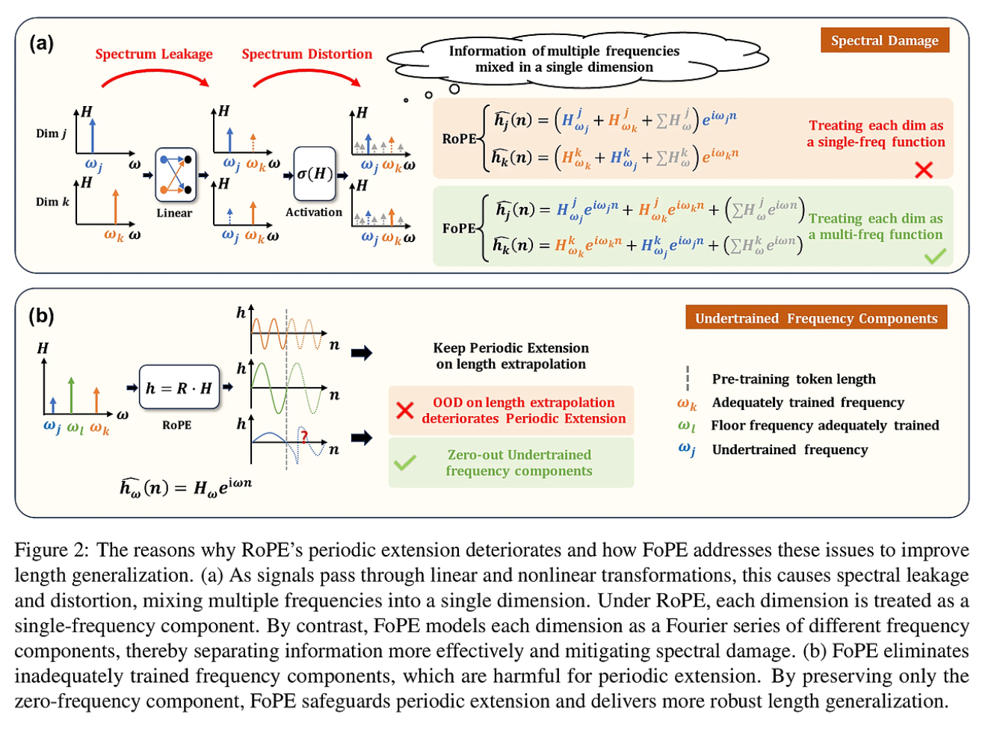

Paper:
```
@article{hua2024fourier,
  title={Fourier Position Embedding: Enhancing Attention's Periodic Extension for Length Generalization},
  author={Hua, Ermo and Jiang, Che and Lv, Xingtai and Zhang, Kaiyan and Ding, Ning and Sun, Youbang and Qi, Biqing and Fan, Yuchen and Zhu, Xuekai and Zhou, Bowen},
  journal={arXiv preprint arXiv:2412.17739},
  year={2024}
}

```

Ref:

# Fourier Position Embedding 

## RoPE的问题

- RoPE使用了三角函数对位置编码进行了变换，实现了可周期延拓的Attention，为长度外推提供了可能性
- 但是RoPE设定了过于理想的假设，即“Hidden States的每个维度只存在单一频率的语义”
- 由于这个假设在LM中并不成立，导致RoPE必须依靠微调、内插等算法才能发挥周期延拓
    - 基于RoPE的模型中，并非只有Attention才影响长度外推，线性层和激活函数也会产生影响（并且是负面影响）
    - RoPE的长距离衰减对长度外推并没有帮助
    - 许多工作认为RoPE本身存在高频和低频分量，但是这里的高、低频只是相对而言

## RoPE做了什么？

- 如果希望位置信息在前向传播过程中不丢失，那就在每一层都使用一遍位置编码

- 如果希望LM在处理语义信息的能力也实现周期延拓，最朴素的想法就是让语义信息也随着位置进行周期性变化，即让语义信息和正弦位置编码相乘即可

RoPE的工作如下：

如果给定第m维的Query向量
$Q_m$
和key向量
$K_m$
，RoPE将这些向量进行旋转，即

$$\tilde{q_m}(n)=Q_m e^{iw_m n}$$

$$\tilde{k_m}(n)=K_m e^{iw_m n}$$

这种旋转将为Attention weights带来周期性。假设位置
$n_a$
和
$n_b$
的两个词汇距离为n，
那么他们之间的attention weight将满足：

$$\tilde{h_m}(n)=H_m e^{iw_m n}$$

$$h(n)=\sum_{m=0}^{M-1} \tilde{h_m}(n)$$

可以看到，每一维的weight自带周期性，整体的attention weight同样会继承这样的特性。理论上RoPE可以实现无线长度的周期延拓。

## 是什么破坏了周期延拓？

RoPE基于假设：Hidden States的每一维只存在单一频率的语义

假设维度m中除了频率 
$w_m$
还存在其他频率
$w_o$
，并且两者的占比满足
$1-\sigma:\sigma$
，那这一维度的attention weight将满足

$$h_m'(n)=H_m[(1-\sigma)e^{iw_m n}+\sigma e^{iw_o n}]$$

显然
$N_{w_m}$
不是频率
$w_o$
的周期，所以原本假设的周期性将被破坏。

频谱损坏的三个来源：
1. 线性函数
2. 激活函数
3. 时域截断

## FoPE是什么？

- 考虑到线性层和激活函数可以带来更强的表征能力，时域截断又受到硬件限制无法改变
- FoPE仍保留了各层中频谱损坏，转而提出了对于频谱损坏更加鲁棒的位置编码
- 鲁棒性的来源：
    1. 既然每一维中不可避免的混杂其他频率的分量，就干脆将每一维建模成一个傅立叶技术
    2. 既然极低低分量周期过长，会导致这些频率分量的周期特性无法被学习到，那就将他们裁剪成频率为0的直流分量
    3. 考虑到直流分量的良好性质，这个新加入的频率既保证的周期性，又可以让每个词汇的信息向无限远的词汇传递

FoPE的公式如下：

$$h_m(n)=H_m(n)f(w_m)$$

$$
f(\omega_m)=
\begin{cases}
1 & ,\omega_m < \omega_l \\
e^{i\omega_m n}+\sum_{\omega} a_{\omega}e^{i\omega n} & ,\omega_m \geq \omega_l
\end{cases}
$$


