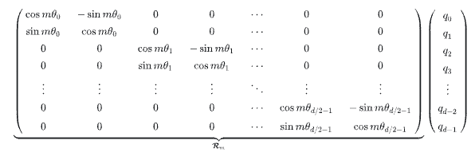

# RoPE-Rotary Position Embedding
Original Paper:
```
@article{su2024roformer,
  title={Roformer: Enhanced transformer with rotary position embedding},
  author={Su, Jianlin and Ahmed, Murtadha and Lu, Yu and Pan, Shengfeng and Bo, Wen and Liu, Yunfeng},
  journal={Neurocomputing},
  volume={568},
  pages={127063},
  year={2024},
  publisher={Elsevier}
}
```

Ref: https://zhuanlan.zhihu.com/p/694558663
## 为什么使用RoPE

- 单纯的Attention并不能捕捉输入的顺序
- Alternative 1 - 绝对编码：将位置信息融入到输入中
- Alternative 2 - 相对编码：微调Attention结构，使其能够识别不同位置到token

## RoPE做了什么？
- RoPE：通过绝对位置编码实现的相对位置编码
- RoPE相当于函数$f$，对于attention中的查询$q$和键$k$进行位置编码，使得$q$和$k$的编码信息中能够加入位置信息
- $\tilde q=f(q,m),\tilde k=f(k,m)$
- 同时，在Attention对 $\tilde q$和$\tilde k$进行内积运算得到的结果带有相对位置信息，即**相对编码性**
    -  $<f(q,m),f(k,n)>=g(q,k,m-n)$

## 如何找到符合性质的函数$f$?

### 考虑二维场景

$$f(q,m)=R_f(q,m)e^{i\Theta_f(a,m)}$$

$$f(k,n)=R_f(k,n)e^{i\Theta_f(k,n)}$$

由此，

$$
\begin{aligned}
f(q,m)\cdot f(k,n)&=R_f(q,m)R_f(k,n)e^{i(\Theta_f(q,m)-\Theta_f(k,n))}\\
&=R_g(q,k,m-n)e^{i\Theta_g(q,k,m-n)}
\end{aligned}
$$

根据对照：

$$R_f(q,m)R_f(k,n)=R_g(q,k,m-n)$$

$$\Theta_f(q,m)-\Theta_f(k,n)=\Theta_g(q,j,m-n)$$

假设$R_f$不依赖位置信息，即

$$R_f(q,m)=\Vert q\Vert,R_f(k,n)=\Vert k\Vert$$

设定初始条件

$$f(q,0)=\Vert q\Vert,R_f(k,0)=\Vert k\Vert$$

进一步$\Theta_f$以及$\Theta_g$研究性质，考虑

$$\begin{aligned}
\Theta_f(q,m)-\Theta_f(k,m)&=\Theta_g(q,k,0)\\
&=\Theta_f(q,0)-\Theta_f(k,0)\\
&:=\Theta(q)-\Theta(k)
\end{aligned}$$

进行移项，并定义

$$\phi(m)=\Theta_f(q,m)-\Theta(q)=\Theta_f(k,m)-\Theta(k)$$

考虑

$$\begin{aligned}
\phi(m)-\phi(m-1)&=[\Theta_f(q,m)-\Theta(q)]-[\Theta_f(k,m-1)-\Theta(k)]\\
&=[\Theta_f(q,m)-\Theta_f(k,m-1)]+\Theta(k)-\Theta(q)\\
&=\Theta_g(q,k,1)+\Theta(k)-\Theta(q)
\end{aligned}$$

等式右侧是一个常数，说明
$\phi(m)-\phi(m-1)$
是一个等差数列，可以考虑
$\phi(m)=m\theta$

由此推导出二维形式：

$$\begin{aligned}
f(q,m)&=R_f(q,m)e^{i\Theta_f(q,m)}\\
&=\Vert q\Vert e^{i(\Theta(q)+m\theta)}\\
&=(\Vert q\Vert e^{i\Theta(q)})e^{im\theta}
\end{aligned}$$

其中，
$\Vert q\Vert e^{i\Theta(q)}$
为 $q$的极坐标形式。

### 考虑高维度场景

使用旋转矩阵进行位置编码，参考以下进行



据此，可以通过旋转矩阵实现对于$q$和$k$的位置编码

$$\tilde q=\mathcal{R}_m q$$

$$\tilde k=\mathcal{R}_n k$$

式中，所有 $\theta$ 为常数，直接取 $\theta_i=10000^{-2(i-1)/d}$