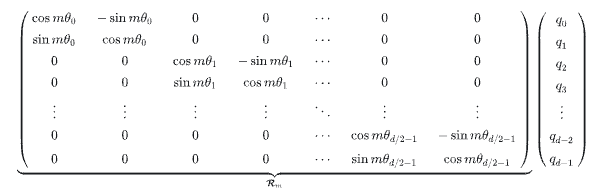

Original Paper:

```
@article{su2024roformer,
  title={Roformer: Enhanced transformer with rotary position embedding},
  author={Su, Jianlin and Ahmed, Murtadha and Lu, Yu and Pan, Shengfeng and Bo, Wen and Liu, Yunfeng},
  journal={Neurocomputing},
  volume={568},
  pages={127063},
  year={2024},
  publisher={Elsevier}
}
```

Ref: https://zhuanlan.zhihu.com/p/694558663

# Existing Works

## 基础框架

- $S_N=\{w_i\}$：N个输入的tokens，其中$w_i$是其中的第i个元素
- 与之相应的word embedding 可以被记做 $E_N=\{x_i\}$
  - 其中，$x_i\in \mathcal{R}^d$ 是token $w_i$的d维的word embedding向量，但不包含位置信息
- Self-attention将位置信息纳入词嵌入，并将其转换为查询、键和值表示，即如下表示：

$$q_m=f_q(x_m,m)$$

$$k_n=f_k(x_n,n)$$

$$v_n=f_v(x_n,n)$$

- 由此，Attention weights可以被如下计算：

$$a_{m,n}=\frac{\exp(\frac{q_m^T k_n}{\sqrt{d}})}{\sum_j \exp(\frac{q_m^T k_j}{\sqrt{d}})}$$

$$o_m=\sum_n a_{m,n}v_n$$

  - 其中，$o_m$为输出

- **当前的工作集中于寻找合适的 $f_q,f_k,f_v$**，有如下几种方式

## Absolute position embedding

定义

$$f_{t:t\in \{q,k,v\}}(x_i,i):=W_{t:t\in \{q,k,v\}}(x_i+p_i)$$

式中，

$$p_{i,2t} = \sin(k / 10000^{2t/d})$$

$$p_{i,2t + 1} = \cos(k / 10000^{2t/d})$$


- 同时，在相关研究中，
$p_i$
也可以是trainable params

## Relative position embedding

### Alternatives-1：设置函数$f$的形式

Refer to
```
@article{shaw2018self,
  title={Self-attention with relative position representations},
  author={Shaw, Peter and Uszkoreit, Jakob and Vaswani, Ashish},
  journal={arXiv preprint arXiv:1803.02155},
  year={2018}
}
```
Implementation, see: [python:relative_position_embedding_alternative_1](code-implement/relative_position_embedding_alter1.py)

定义：

$$f_q(x_m)=W_q x_m$$

$$f_k(x_n,n)=W_k(x_n+\tilde p_r^k)$$

$$f_v(x_n,n)=W_v(x_n+\tilde p_r^v)$$

式中，

- $\tilde p_r^k,\tilde p_r^v$ 是可被训练的相对位置embedding
- $r=clip(m-n,r_{\min},r_{\max})$ 代表了m和n之间的相对位置

### Alternatives-2：对于attention weights的表达式进行修改

Recall Attention weights 的计算方式

$$a_{m,n}=\frac{\exp(\frac{q_m^T k_n}{\sqrt{d}})}{\sum_j \exp(\frac{q_m^T k_j}{\sqrt{d}})}$$

考虑使用绝对编码的方式进行embedding，即

$$f_{t:t\in \{q,k,v\}}(x_i,i):=W_{t:t\in \{q,k,v\}}(x_i+p_i)$$

#### Method 1: Dal et al.

对于
$q_m^T k_n$
，可以被写作如下方式

$$q_m^T k_n=x_m^T W_q^T W_k x_n+x_m^T W_q^T W_k p_n+p_m^T W_q^T W_k x_n+p_m^T W_q^T W_k p_n$$

使用相对编码 $\tilde p_{m-n}$ 来替换 $p_n$，即使用$W_k p_n$来替换$\tilde W_k \tilde p_{m-n}$

$$q_m^T k_n=x_m^T W_q^T W_k x_n+x_m^T W_q^T \tilde W_k \tilde p_{m-n}+p_m^T W_q^T W_k x_n+p_m^T W_q^T \tilde W_k \tilde p_{m-n}$$

#### Method 2: Raffel et al., He et al. , Ke et al.,Huang et al.

相关code: [Raffel_T5](code-implement/Raffel_T5_position_encoding.py)

仅将相对位置信息编码到注意力权重中

$$q_m^T k_n=x_m^T W_q^T W_k x_n +b_{i,j}$$

- 式中，
$b_{i,j}$
是一个可被训练的bias项

#### Method 3: Raffel et al.

相关code:[Raffel_project](code-implement/Raffel_projection.py)

使用不同的投影矩阵来模拟一对单词或位置

$$q_m^T k_n=x_m^TW_q^TW_k x_n+p_m^T U_q^T U_kp_n+b_{i,j}$$

<!--  Q:查看原文， $U_k$是什么 ? A:投影矩阵-->


#### Method 4: He et al.（最高效的方式）

相关code：[He_DeBERTa](code-implement/He_DeBERTa.py)

只有使用中间两个项才能完全建模两个标记的相对位置，即使用如下方式进行计算

$$q_m^T k_n=x_m^T W_q^T W_k x_n+x_m^T W_q^T W_k \tilde p_{m-n}+\tilde p_{m-n}^T w_q^T W_k x_n$$

<!-- TODO: 可以看一下Radford & Narasimhan, 2018的postion encoding 的比较论文 -->

# RoPE-Rotary Position Embedding
## 为什么使用RoPE

- 单纯的Attention并不能捕捉输入的顺序
- Alternative 1 - 绝对编码：将位置信息融入到输入中
- Alternative 2 - 相对编码：微调Attention结构，使其能够识别不同位置到token

## RoPE做了什么？
- RoPE：通过绝对位置编码实现的相对位置编码
- RoPE相当于函数$f$，对于attention中的查询$q$和键$k$进行位置编码，使得$q$和$k$的编码信息中能够加入位置信息
- $\tilde q=f(q,m),\tilde k=f(k,m)$
- 同时，在Attention对 $\tilde q$和$\tilde k$进行内积运算得到的结果带有相对位置信息，即**相对编码性**
    -  $<f(q,m),f(k,n)>=g(q,k,m-n)$

## 如何找到符合性质的函数$f$?

### 考虑二维场景

$$f(q,m)=R_f(q,m)e^{i\Theta_f(a,m)}$$

$$f(k,n)=R_f(k,n)e^{i\Theta_f(k,n)}$$

由此，

$$
\begin{aligned}
f(q,m)\cdot f(k,n)&=R_f(q,m)R_f(k,n)e^{i(\Theta_f(q,m)-\Theta_f(k,n))}\\
&=R_g(q,k,m-n)e^{i\Theta_g(q,k,m-n)}
\end{aligned}
$$

根据对照：

$$R_f(q,m)R_f(k,n)=R_g(q,k,m-n)$$

$$\Theta_f(q,m)-\Theta_f(k,n)=\Theta_g(q,j,m-n)$$

假设$R_f$不依赖位置信息，即

$$R_f(q,m)=\Vert q\Vert,R_f(k,n)=\Vert k\Vert$$

设定初始条件

$$f(q,0)=\Vert q\Vert,R_f(k,0)=\Vert k\Vert$$

进一步$\Theta_f$以及$\Theta_g$研究性质，考虑

$$\begin{aligned}
\Theta_f(q,m)-\Theta_f(k,m)&=\Theta_g(q,k,0)\\
&=\Theta_f(q,0)-\Theta_f(k,0)\\
&:=\Theta(q)-\Theta(k)
\end{aligned}$$

进行移项，并定义

$$\phi(m)=\Theta_f(q,m)-\Theta(q)=\Theta_f(k,m)-\Theta(k)$$

考虑

$$\begin{aligned}
\phi(m)-\phi(m-1)&=[\Theta_f(q,m)-\Theta(q)]-[\Theta_f(k,m-1)-\Theta(k)]\\
&=[\Theta_f(q,m)-\Theta_f(k,m-1)]+\Theta(k)-\Theta(q)\\
&=\Theta_g(q,k,1)+\Theta(k)-\Theta(q)
\end{aligned}$$

等式右侧是一个常数，说明
$\phi(m)-\phi(m-1)$
是一个等差数列，可以考虑
$\phi(m)=m\theta$

由此推导出二维形式：

$$\begin{aligned}
f(q,m)&=R_f(q,m)e^{i\Theta_f(q,m)}\\
&=\Vert q\Vert e^{i(\Theta(q)+m\theta)}\\
&=(\Vert q\Vert e^{i\Theta(q)})e^{im\theta}
\end{aligned}$$

其中，
$\Vert q\Vert e^{i\Theta(q)}$
为 $q$的极坐标形式。

### 考虑高维度场景

使用旋转矩阵
$R_{\Theta,m}^d$
进行位置编码，参考以下进行



据此，可以通过旋转矩阵实现对于$q$和$k$的位置编码，即

$$f_{q,k}(x_m,m)=R_{\Theta,m}^d W_{q,k} x_m$$

式中，所有 $\theta$ 为常数，直接取 $\theta_i=10000^{-2(i-1)/d}$

同时，可以将rotation matrix应用于 attention weights

$$\begin{aligned}
q_m^T k_n&=(R_{\Theta,m}^d W_{q,k} x_m)^T(R_{\Theta,m}^d W_{q,k} x_m)\\
&=x^T W_q R_{\Theta,n-m}^d W_k x_n
\end{aligned}$$

式中，定义 
$R_{\Theta,n-m}^d=(R_{\Theta,m}^d)^T(R_{\Theta,m}^d)$


